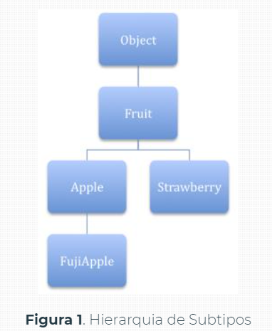
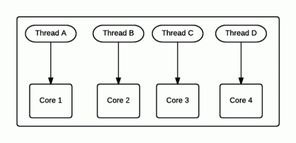
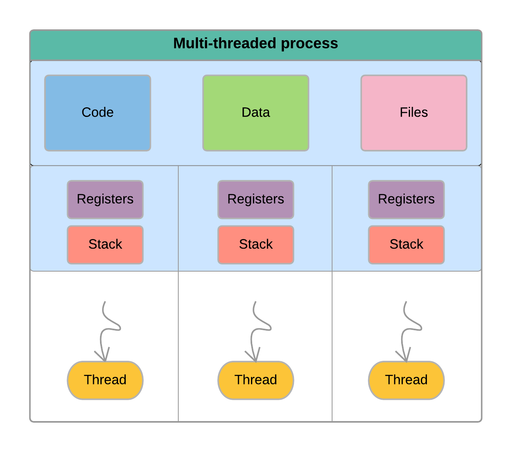
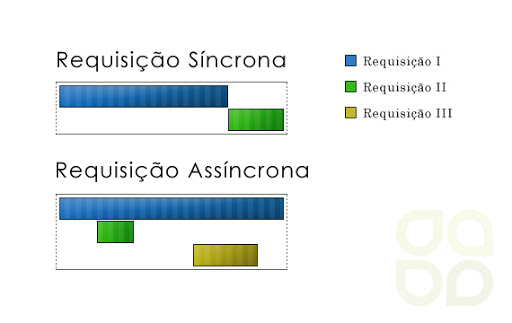

# **_Desenvolvimento avançado em java_**

# **_Paradigmas Funcionais no java_**

## **Entenda o que é paradigma funcional**
Conceito ficou mais fácil a ser aplicado apartir do java 8.
1. Entender o Paradigma Funcional no java
2. Aprender como utlizar uma lambda e API Lambda do java
3.  Entender paradigma da recursividade(Tail Operation and Otimization andmemorization)

### **Generics em java**
A motivação de estudar Generics em Java é de poupar o desenvolvedor de códigos redundantes, como é o caso de casting excessivo. Este foi introduzido desde o Java SE 5.0.

Para iniciarmos vamos a um exemplo muito comum, apresentado como ficaria uma Lista de Objetos com Generics e outra sem Generics.

```java
    /* COM GENERICS */
    List<Apple> box = ...;
    Apple apple = box.get(0);

    /* SEM GENERICS */
    List box = ...;

    /*
    Se o objeto retornado de box.get(0) não puder
    ser convertido para Apple, só saberemos disso em tempo
    de execução
    */
    Apple apple = (Apple) box.get(0);
```
>Uso do Generics

De inicio já podemos notar 2 problemas básicos que são encontrados quando optamos por não utilizar Generics:

1. Teremos que fazer um cast para o objeto do tipo Apple toda vez que capturarmos algo da List box;
2. Caso algum erro de cast ocorra, só veremos em tempo de execução, pois este cast só será feito assim que este determinado trecho do código for executado. Diferente do Generics, que o erro é em tempo de compilação, ou seja, já nos deparamos com o erro antes mesmo de tentar executar o projeto, o próprio compilador nos avisará que não é possível atribuir um objeto box ao Apple pois estes são de tipos diferentes, veja um exemplo abaixo que já apresenta erro em tempo de compilação.

```java
    List<Orange> box = ...;

    /*
    Erro em tempo de compilação pois
    uma lista de Orange não pode ser atribuido a um
    objeto do tipo Apple. Isso porque ao fazer “box.get(0)”
    estamos retornando um Orange e não um Apple.
    */
    Apple apple = box.get(0);
```
> Erro em tempo de compilação com Generic
#### **Generic em Classes e Interfaces**
Podemos também utilizar os Generics em Classes ou Interfaces. Estes servem como parâmetro para nossa Classe, assim poderemos utilizar esta “variável” em todo escopo de nossa classe. Veja o exemplo:

```java
public interface List<T> extends Collection<T> {
...
}
```
> Usando Generic em Interfaces
Esta é a interface da List em Java, perceba que podemos fazer: List pois a interface nos permite isso. A vantagem de fazer isso é o retorno do Objeto quando fazemos um “get”, veja :

`T get(int index)`
>Retornando objetos generics

O método acima irá retornar um objeto do tipo “T” dado determinado index, e quem é T ? Em princípio não sabemos, só vamos descobrir ao implementar a interface. Na listagem 1 o nosso T = Apple.

Sendo assim, o mesmo poderá ser utilizado durante todo desenvolvimento da interface para evitar o uso de castings excessivos. São inúmeras as possibilidades que temos ao se trabalhar com Generics em Classes e Interfaces, muitos problemas que antes seriam resolvidos com horas e até dias de código “sujo”, podem ser resolvidos em apenas algumas linhas, basta ter a habilidade necessária para utilizar tal ferramenta.

#### **Generics em Métodos e Construtores**
Antes de começar a explicação, vamos mostrar o exemplo do uso de Generics em um método Java.

```java
public static <T> getFirst(List<T> list)
```
> Usando Generics em Métodos
Perceba que o método getFirst aceita uma lista do tipo T e retorna um objeto do tipo T.

A iteração em Java (Iterator) também possui Generic, assim um Iterator pode facilmente ser retornado para um novo objeto sem a necessidade do Cast explícito.

```java
for (Iterator<String> iter = str.iterator(); iter.hasNext();) {
    String s = iter.next();
    System.out.print(s);
}
```

O que você percebe acima é o uso do Generic para transformar o Iterator em iterações apenas de String, assim sempre que fizermos `iter.next()` estamos automaticamente retornando uma String sem precisar fazer `String.valueOf(iter.next())`.

O código também pode ser convertido para um foreach, assim aproveitamos também o recurso de generic que nós é oferecido

```java
for (String s: str) {
    System.out.print(s);
}
```
#### **Subtipos Genéricos**
Antes de iniciar a explicação do funcionamento de subtipos em Generics, é importante entender o conceito em Java. Entenda que em Java a seguinte hierarquia é totalmente possível:



Significa que um Apple é um Fruit e um Fruit é um Object, então um Apple é um Object também. Analogamente, se A é filho B e B é filho de C, então A é filho de C. A referencia contida no code abaixo só é possível por esta hierarquia imposta no Java.


```java
Apple a = ...;
Fruit f = a;
```
>Hierarquia de classes
Tudo isso foi explicado para que possamos finalmente chegar neste assunto incluso no Generics, veja o código abaixo:

```java
List<Apple> apples = ...;
List<Fruit> fruits = apples;
```
> listagem 9: subtipos em generics

Se seguirmos o raciocínio da explicação acima, o código acima será compilado normalmente sem nenhum erro. Porém isso não é possível no Generics, pois em algumas situações poderia ocorrer uma quebra a consistência da linguagem. Como assim ? Vamos explicar.

Imagine que você tem o código da listagem 9 funcionando normalmente (o que não é o caso). Temos então uma caixa de maças, e transformamos nossa caixa de maças em uma caixa de frutas, pois toda maça é fruta, certo ?

Agora já que temos uma caixa de frutas (que sabemos na verdade que ela é uma caixa de maças), o que nos impede de colocar morangos ? Nada. Veja na listagem 10 o que poderíamos fazer se a listagem 9 compilasse sem erros.

```java
List<Apple> apples = ...;
List<Fruit> fruits = apples;
fruits.add(new Strawberry());
```
> Listagem 10. Forma errada de usar Generics
O código acima está logicamente errado, pois antes havíamos atributo a caixa de maças a caixa de frutas, ou seja, nossa atual caixa de frutas na verdade é uma caixa de maças, mas desta forma nada nos impede de colocar um moranga em uma caixa de frutas, isso porque, um morango também é uma fruta. É por este motivo que o Generic não permite esse tipo de atribuição. Podemos resumir isso tudo a apenas uma só frase: Generics são invariantes.

#### **Wildcards**
Antes de começar a entender o funcionamento de WildCards em Generics, entenda o porque utilizá-lo. Lembre-se da listagem 10 onde mostramos que não é possível atribuir uma lista de “Apples” a uma lista de “Fruits” mesmo o tipo Apple sendo filho de Fruit, isso porque estaríamos quebrando o “contrato” que diz que Apple só aceita Apple, pois se colocarmos este como Fruit, poderíamos aceitar Morangos, laranjas e etc.

Enfim, com Wildcards solucionamos este problema. Veja como:

Existem 3 tipos de Wildcards em Generics:

* Unknown Wildcard, ou seja, Wildcard desconhecido.
* Extends Wildcard
* Super wildcard
  
Vamos explicar os 3 nos próximos tópicos.

#### **Unknown Wildcard**
Como você não sabe o tipo do objeto, você deve tratá-lo da forma mais genérica possível. Veja o exemplo abaixo do uso deste Wildcard.

```java
public void processElements(List<?> elements){
           for(Object o : elements){
              System.out.println(o);
           }
        }

/* Podemos atribuir um list de qualquer tipo a nosso
método, pois ele tem um tipo desconhecido/genérico */
List<A> listA = new ArrayList<A>();

    processElements(listA);
```
> Listagem 11. Usando Unknown Wildcard

#### **Extends Wildcard**
Podemos utilizar este tipo de Wildcard para possibilitar o uso de vários tipos que se relacionam entre si, ou seja, podemos dizer que o nosso método `processElements` aceita uma lista de qualquer tipo de Frutas, seja moranga, maça ou etc. Vejamos.

```java
public void processElements(List<? extends Fruit> elements){
           for(Fruit a : elements){
              System.out.println(a.getValue());
           }
        }

/* Podemos agorar passar nossas frutas diversas ao método processElements */
List<Apple> listApple = new ArrayList<Apple>();
    processElements(listApple);

    List<Orange> listOrange = new ArrayList<Orange>();
    processElements(listOrange);

    List<Strawberry> listStrawberry = new ArrayList<Strawberry>();
    processElements(listStrawberry);
```
> Listagem 12. Usando extends wildcard

#### **Super wildcard**
Ao contrário do extends, o wildcard super permite que elementos Fruit e Object sejam utilizados, isso significa que apenas são permitidos de “Fruit para cima”. Se fizermos um List estamos permitindo todos os Apples, Fruits e Objects.

Para finalizar, vamos a um último exemplo utilizando Generics e vendo qual será a saída do mesmo:

```java
public class Box<T> {

    private T t;

    public void add(T t) {
    this.t = t;
    }

    public T get() {
    return t;
    }

    public static void main(String[] args) {
        Box<Integer> integerBox = new Box<Integer>();
        Box<String> stringBox = new Box<String>();

        integerBox.add(new Integer(10));
        stringBox.add(new String("Hello World"));

        System.out.printf("Integer Value :%d\n\n", integerBox.get());
        System.out.printf("String Value :%s\n", stringBox.get());
    }
}
```
> Listagem 13. Último exemplo Generics

Saída deste código:

```
Integer Value :10

String Value :Hello World
```


### **Collectionds: List, Set e Interator**
Recursos disponiveis na linguagem java: `List`, `ArrayList`, `Set`, `HashSet`, `Iterator` e um pouco de `Generics`.

List e Set. Ambos armazenam uma “lista”. A diferença principal é que o 'Set' não aceita elementos duplicados, diferente do List.

#### **List e ArrayList**
O `List` é uma interface e o `ArrayList` é a classe que a implementa. Veja um exemplo na Listagem 1.

```java
import java.util.ArrayList;
import java.util.LinkedList;
import java.util.List;


public class DevmediaList {

       /**
        * @param args
        */
       public static void main(String[] args) {

             /*
              * Declaremos nosso objeto sem nenhuma instância
              *
              * */
             List carros;

             /*
              * Criamos uma instância qualquer para o nosso objeto
              * do tipo List, sendo que essa instância deve
               * obrigatoriamente implementar a interface List.
              * Veja as possibilidades
              * */
             carros = new ArrayList();
             carros = new LinkedList();

             //e assim por diante...


       }

}
```
> Listagem 1. Criando um ArrayList a partir do List

Então você pode questionar: Porque não fazer um ArrayList carros = new ArrayList(); sem usar as interfaces? Por uma questão muito simples: você precisa garantir a flexibilidade da sua aplicação, garantir que o mesmo objeto possa ser instanciado de maneiras distintas em pontos distintos da aplicação. Como você tem uma interface List, você tem certeza dos métodos que seu objeto tem, mesmo que ele seja instanciado por uma classe como ArrayList ou LinkedList. Vamos melhorar um pouco mais nossa Listagem 1, adicionando o uso de Generics (Listagem 2).

```java
import java.util.ArrayList;
import java.util.List;


public class DevmediaList {

     /**
      * @param args
      */
     public static void main(String[] args) {

           /*
            * Agora adicionamos um Generic "<Carro>", assim só podemos
            * adicionar objetos do tipo 'Carro' nossa lista.
            *
            * */
           List<Carro> carros;

           /*
            * Criamos uma ArrayList apenas com carros
            * */
           carros = new ArrayList<Carro>();


           /*
            * Você conseguirá criar sem problemas um ArrayList
            * sem passar o tipo Generic, mas a IDE irá dar um
             * Warning dizendo que você deveria passar um
            * tipo Generic, para evitar erros em runtime.
            * */
           carros = new ArrayList();

           /*
            * O código abaixo não será compilado, erro em tempo de
            * design. Pois nosso objeto 'carros' agora é muito
             * exigente: Só aceita implementações de List que tenham
            * objetos do tipo 'Carro'. Estamos tentando fazer
             * um 'cast' de Animal para Carro e
            * isso não possível.
            * */
           carros = new ArrayList<Animal>();

     }

}
```
> Listagem 2. Usando Generics com ArrayList e List
> 
Para finalizar o uso do List, vamos mostrar alguns métodos muito utilizados no dia a dia. Observe a Listagem 3.

```java
import java.util.ArrayList;
import java.util.List;


public class DevmediaList {

   /**
    * @param args
    */
   public static void main(String[] args) {

         List<Carro> carros = new ArrayList<Carro>();
         List<Carro> carrosNovos = new ArrayList<Carro>();

         Carro carro = new Carro();

         //adiciona um carro a nossa lista
         carros.add(carro);

         //adiciona um carro a uma posição exata da lista
         carros.add(10, carro);

         /*
          * Imagine que desejamos adicionar uma lista de
           * carros novos a nossa lista de carros,
          * podemos adicionar todos de uma só vez, usando o 'addAll'
          * */
         carros.addAll(carrosNovos);

         /* Caso prefira, pode usar um for para adicionar
          * os carrosNovos.Nosso laço FOR abaixo, tem a mesma
           * função do addAll.
         */
         for(int i = 0 ; i < carrosNovos.size(); i++){
                carros.add(carrosNovos.get(i));
         }

         /*
          * Verifica se o carro está na lista de carros.
           * Mas como essa verificação é feita ?
          * Através do método 'equals' do seu objeto carro.
           * Sendo assim, na implementação do
          * seu bean 'Carro', é muito importante que você
           * sobreescreva o método 'equals' dizendo
          * como as comparações devem ser realizadas.
          * */
         carros.contains(carro);

         //Remove todos os elementos da lista
         carros.clear();

   }

}
```
> Listagem 3. Uso de métodos frequentes com List

Esses métodos mencionados acima são os usados com muita frequência, mas nada impede que você faça um estudo em cada método.

#### **Set e HashSet**

Assim como o `List` é uma interface e o `ArrayList` é sua implementação, o `Set` e `HashSet` seguem a mesma analogia, onde o Set é a interface e o HashSet é sua implementação. Observe a Listagem 4.

```java
import java.util.HashSet;
import java.util.LinkedHashSet;
import java.util.Set;


public class DevmediaSet {

   /**
    * @param args
    */
   public static void main(String[] args) {

         Set<Carro> carros;

         //Você pode implementar com HashSet
         carros = new HashSet<Carro>();


         //Pode também optar pelo LinkedHashSet
         carros = new LinkedHashSet<Carro>();

         //e assim por diante


   }

}
```
> Listagem 4. Usando Set

Você já deve ter percebido que podemos implementar diferentes instâncias para uma mesma interface Set, obviamente que cada uma tem sua peculiaridade e não é foco deste artigo mostrar as peculiaridades de cada implementação.

Uma diferença muito comum entre o Set e o List é o retorno de determinados elementos em uma posição exata da lista, pois com o List podemos simplesmente fazer um 'get(index)' e você terá o elemento X na posição INDEX. Na Listagem 5 iremos demonstrar como percorrer todos só elementos usando o iterator.

```java
import java.util.HashSet;
import java.util.Iterator;
import java.util.Set;


public class DevmediaSet {
   /**
    * @param args
    */
   public static void main(String[] args) {

         Set<Carro> carros;

         //Você pode implementar com HashSet
         carros = new HashSet<Carro>();

         /*
          * Percorrer todo SET com iterator
          * */
         Iterator<Carro> carrosAsIterator = carros.iterator();
         while (carrosAsIterator.hasNext()){
                Carro it = carrosAsIterator.next();
         }
   }
}
```
> Listagem 5. Usando iterator para capturar elementos no Set
No exemplo acima, abstraíamos a maioria dos comentários que já fizemos nas listagens anteriores, assim tornamos o mesmo sucinto e prático. Veja na Listagem 6 um exemplo mais completo de como trabalhar com Iterator.

```java
import java.util.ArrayList;
import java.util.Iterator;
import java.util.ListIterator;

public class DevmediaSet2 {

 public static void main(String args[]) {

    ArrayList al = new ArrayList();

    al.add("C");
    al.add("A");
    al.add("E");
    al.add("B");
    al.add("D");
    al.add("F");

    // Usamos o iterator para mostrar o conteúdo do ArrayList
    System.out.print("Original contents of al: ");
    Iterator itr = al.iterator();
    while(itr.hasNext()) {
       Object element = itr.next();
       System.out.print(element + " ");
    }
    System.out.println();

       // Modify objects being iterated
    ListIterator litr = al.listIterator();
    while(litr.hasNext()) {
       Object element = litr.next();
       litr.set(element + "+");
    }
    System.out.print("Modified contents of al: ");
    itr = al.iterator();
    while(itr.hasNext()) {
       Object element = itr.next();
       System.out.print(element + " ");
    }
    System.out.println();


    System.out.print("Modified list backwards: ");
    while(litr.hasPrevious()) {
       Object element = litr.previous();
       System.out.print(element + " ");
     }
     System.out.println();
  }
}
```
> Listagem 6. Trabalhando com Iterator
>
Os exemplos mostrados acima são práticos o suficiente para que você leitor possa questionar o uso de tais recursos em seu dia a dia. Algumas vezes utilizados de forma errada. É comum, por exemplo, em projetos iniciantes notarmos a falta de interfaces e implementações corretas de polimorfismo, por exemplo. Este artigo tem como principal objeto não só mostrar o uso dos recursos, já conhecidos por muitos, mas também mostrar a forma correta e ideal de utilizá-los. Então, caso você esteja utilizando outra forma que seja distinta da mostrada nas seções anteriores, aconselhamos que a mesma seja analisada.

Dizemos 'analisada', pois toda nova solução ou alteração deve ser analisada antes de alterada, e não simplesmente trocada sem uma análise crítica.

Para finalizar veja na Listagem 7 uma forma alternativa de utilizar o iterator com um 'foreach'.
```java
import java.util.HashSet;
import java.util.Iterator;
import java.util.Set;


public class DevmediaSet {

   /**
    * @param args
    */
   public static void main(String[] args) {

         Set<Carro> carros;

         //Você pode implementar com HashSet
         carros = new HashSet<Carro>();

         /*
          * Percorrer todo SET com iterator usnado foreach
          * */
         for(Iterator<Carro> iter = carros.iterator();
           iter.hasNext();) {
             Carro carroAtual = iter.next();
         }


   }

}
```
> Listagem 7. Usando iterator com foreach

A forma demonstrada acima é uma alternativa ao while(it.hasNext()) que utilizamos nas listagens acima.


###  **O que é paradigma**

Um `paradigma` é um **padrão de raciocínio** para resolução de problemas. 

- A maioria das linguagens podem suportar **mais de um paradigma**.

- Cabe ao programador escolher o paradigma **mais adequado** ao seu problema.

### **Programação Funcional**

Programação funcional é o processo de construira software através de composição de funções puras, evitando compartilhamento de estados, dados mutáveis e efeitos colaterais. É declarativa ao invés de imperátiva, essa é uma definição de Eric Elliot.
> Conceito imperativo: respeita as ordens,instrução a ser seguida


### **Paradigma Imperativo**

Paradigma Imperativo: E aquele que expressa o código através de comandos ao computador, nele é possível ter controle de estado dos objetos.
> Linguagens c, java no code das primeira versões seguiam o paradigma iterativo. Funcionavam como ordens davas ao computador. Ordem executado instantâneamente. Exemplo for(faz agora);

O paradigma imperativo de programação é assim chamado por ser baseado em comando que utilizam/manipulam variáveis armazenadas em memória.

- Imperativo originou-se do latim e significa `comandar`.

- Fundamenta-se em comandos que manipulam posições de memória através de variáveis.

**_Exemplo:_**

```C++
#include <stdio.h>

int main(int argc, char const *argv[] ){
   char ch = "";
   scanf("%c",&ch); //Manipulação de memória através de váriaveis
   printf("A letra : %c \n", ch); //aqui também
   return 0;
}
```

```java
public cass Aula{
   public static void main(String[] args){
      int valor = 10; //Instrução
      int resultado = valor * 5; //Intrução
      System.out.println("O resutado é ::" + resultado); //Instrução
   }
}
```


### **Paradigma Funcional**

Paradigma funcional: Damos uma regra, uma declaração de como queremos que o programa se comporte.

```java
class Funcional{
   public static void main(String[] args){
      
      UnaryoOperator<Integer> calcularValorVezesTres = valor -> valor->3;//Um conceito de paradifma funcional
      int valor = 10;
      System.out.println("O resultado é ::" + calcularValorVezesTres.apply(10));
   }
}
```


## **Funções e imutabilidade em Paradigmas Funcional**


### **Conceitos fundamentais da programação funcional**

Composição de funções: é criar uma nova função através de composição de outras. Por exemplo, vamos criar uma função que vai filtrar um array, filtrando somente os números pares e multiplicando por dois.

```java

import java.util.Arrays;

public class ComposicaoDeFuncoes {
    public static void main(String[] args) {
        int[] valores = {1,2,3,4};

        // funcional
        Arrays.stream(valores)
                .filter(numero -> numero % 2 == 0) 
                .map(numero -> numero * 2)
                .forEach(numero -> System.out.println(numero));
         //Imperativo
         for (int i = 0; i < valores.length; i++){
            int valor= 0;
            if(valores[i] %2 ==0){
                valor = valores[i] *2;
                if(valor != 0){
                    System.out.println(valor);
                }
            }
        }
    }
}
```
 
#### **Funções puras**

Funções puras: É chamada de puta quando invocada mais de uma vez produz exatamente o mesmo resultado.

```java
import java.util.function.BiPredicate;

public class FuncoesPuras {
    public static void main(String[] args) {
        BiPredicate<Integer,Integer> verificarSeEMaior =
                (parametro, valorComparacao) -> parametro > valorComparacao;

        System.out.println(verificarSeEMaior.test(13,12));
        System.out.println(verificarSeEMaior.test(13,12));
    }
}

```
#### **Imutabilidade**
Significa que uma vez que uma variável que recebeu um valor, vai possuir esse valor para sempre, ou quando criamos um objeto ele não pode ser modificado.

```java
import java.util.function.UnaryOperator;

public class Imutabilidade {
    public static void main(String[] args) {
        int valor = 20;
        UnaryOperator<Integer> retornarDobro = v -> v * 2;
        System.out.println(retornarDobro.apply(valor)); // retorna o dobro do valor
        System.out.println(valor); // valor nao sera alterado
    }
}

```
#### **Imperativo x Declaratiovo**

É muito comum aprender a programar de forma imperatica, onde mandamos alguém fazer algo. Busque o usuário 15 no banco de dados. Valide essa informações do usuário.

Na programação funcional tentamos programar de forma declarariva, onde declaramos o que desejamos, sem explicar como será feito. Qual o usuário 15? Quais os erros dessas informações?

```java
//FORMA IMPERATIVA
public class Aula {
   public static void main(String[] args) {
      System.out.println(buscarUsuario(15));
   }
   public static Object buscarUsuario(final Integer id){
      //retorna o usuário
      return new Object;
   }
}
//FORMA DECLARATIVO COM EXPRESSÃO LAMBA
public class Aula {
   public static void main(String[] args) {
      Function<Integer,Object> buscarUsuario = idusuario -> //Busca Usuaio return new Object;
      //Comportamento, 
   }
}
```
### **Exercício final**

1. E aquele que expressa o código através de comando ao computador, nele é possível ter controle de estado dos objetos, de acordo com a afirmação. Qual alternativa repesenta esse programa:

a) () Declarativo //Funciona como uma declaração, não em ordem
b) () Imutabilidade
c) () Funcional //Composição de funções
d) () Recursividade
e) (x) Imperativo //Trata de da ordem linha a linha

2. Dados uma regra, uma declaração de como queremos que o programa se comporte, de acordo com a afirmação. Qual das alternativas representa esse paradigma.

a) () Composição de funções //Composição de funcões, paramtro sendo outra função
b) () Imutabilidade //Valor intanciado inicialmente, não muda
c) (x) Funcional //Damos uma regra, uma declaração de como queremos que o programa se comporte
d) () Recursividade //Realiza a tarefa com acumulando
e) () Imperativo   //Ordem para executar

3. Uma vez que uma variável que recebe um valor, esta vai possuir esse valor para sempre, ou quando criamos um objeto ele não poder ser modificado, de acordo com a afirmação. Qual alternativa representa esse paradigma.

a) () Composição de funções 
b) (x) Imutabilidade
c) () Funcional 
d) () Recursividade
e) () Imperativo 

## **Lambda no Java**

Os lambdas obedecom o conceito do paradigma funcional, com eles podemos facilitar legibilidade do nosso código, além disso com a nova API Funcional do java podemos ter uma alta produtividade para lidar com objetos. Primeiramente, devemos entender o que são interfaces funcionais.

Interfaces funcionais - são interfaces que possuem apenas um método abstrato. Exemplo.

```java
public interfece Funcao{
   String gerar(String valor);
}
```
Geralmente as interfaces funcionais possuem uma anotação em nível de classe(@FunctionalInterface), para forçar o compilador a apontar um erro se a interface não estiver do acordo com as regras de uma interface funcional. Esta anotação não obrigatória, pois o compilador conseque reconhecer uma interface em tempo de compilação.

```java
public class Aula {
    public static void main(String[] args) {
        Funcao1 funcao1 = valor -> {
            return valor;
        };
        System.out.println(funcao1.gerar("Joao"));
    }
}


@FunctionInterface //Protecção para manter somente uma função abstract na interface, isso possiblitida a não quebra de códigos.
interface Funcao1 {
    String gerar(String valor);
}

@FunctionInterface
interface Funcao2{
    String gerar(String valor);
    default int soma(int a,int b){
        return a +b;
    }; //Forma de manter duas funções em uma interface
}
```
Antes do java 8, se quiséssemos implementar um comportamento especifico para uma única classe deveríamos utilizar uma classe anônima para implementar este comportamento.

```java
public class FuncaoComClasseAnonima {
    public static void main(String[] args) {
        Funcao colocarPrefixoSenhorNaString = new Funcao() {
            @Override
            public String gerar(String valor) {
                return "Sr. "+valor;
            }
        };
        System.out.println(colocarPrefixoSenhorNaString.gerar("Joao"));
    }
}
```
Agora que sabemos como se define uma interface funciona podemos, aprender como se define uma lambda.
Estrutura de uma lambda:

   `InterfaceFuncional nomeVariavel = parametro -> logica`

Para entender melhor utilizaremos o exemplo da Função.

Vimos que a sintaxe fica bastante verbosa e o código fica bastante confuso utilizando esta implementação, agora escrevemos exatamente o mesmo código utilizando o lambda da interface Função:

```java
public class FuncaoComLambda {
    public static void main(String[] args) {
        Funcao colocarPrefixoSenhorNaString = valor -> "Sr. "+valor;
        System.out.println(colocarPrefixoSenhorNaString.gerar("Joao"));
    }
}

@FunctionalInterface
interface Funcao{
   String gerar(String valor);
}
```
### **Bastante atenção!!**
- Quando uma lambda possui apenas uma instrução no corpo de sua lógica não é necessário o uso de chaves.

Exemplo:

```java
Funcao colocarPrefixoSenhorNaString = valor ->"Sr."+valor;
```
Se a função possui mais de uma instrução DEVEMOS utilizar chaves e alem disso deve explicitar o retorno se o retorno for diferente de void. 

Exemplo:

```java
Funcao concatenaSrNaString = valor-> {
   String valorComprefixo = "Sr. " + valor;
   String valorComPrefixoFinal= valorComprefixo + ".";
   return valorComPrefixoFinal;
};
```
### **Exemplos de criação de expressões lambdas**
```java
public class Aula {
    public static void main(String[] args) {
        Funcao1 funcao1 = valor -> {
            return valor;
        };
        System.out.println(funcao1.gerar("Rô"));

        Funcao2 funcao2 =(x,y) -> {
            int soma = x + y; return soma;
        };
        System.out.println(funcao2.soma(1,3));

        Funcao3 funcao3 = ((nome, sobrenome) -> {
            System.out.println("Seu nome é: " + nome + " " + sobrenome);
        });

        funcao3.parametros("Rô","Capry");
    }
}


interface Funcao1 {
    String gerar(String valor);
}

interface Funcao2{
    Integer soma(int x,int y);
}

interface Funcao3{
    void parametros(String nome,String sobrenome);
}
```
### **Exercício final**

4. Qual é a sintaxe base de uma lambda?
a) () Tipo nomeVariavel = (parametro) -> {logica};
b) () Tipo nomeVariavel = valor;
c) () TipoAbstrato nomeVariavel = valor;
d) (x) InterfaceFuncional nomeVariavel = paramtro -> logiva
e) () TipoEnum nomeVariavel = paramtro -> logiva

5. Quando devemos utilizar chaves em uma lambda?
a) () Quando o mesmo possui apenas uma instrução
b) () Quando utilizamos a referência do método
c) () Quando utilizamos a interface Runnable
d) (x) Quando o mesmo possui mais de uma instrução
e) () Quando o mesmo não possui nenhuma intrução.

6. Qual das alternativas a seguir e uma declaração de um lambda.

a) () Funcao a = "2";
b) () Funcao a => "2";
c) () Funcao a = a => "2";
d) () Fucao a -> "2";
e) (x) Funcao a = valor -> "2";

7. Antes do java 8, qual era a estratégia utilizada para implementação de interface em uma classe especifica. 
a) (x) Classe anônima
b) () Declaração de uma outra interface
c) () Enum
d) () Classe Abstrata
e) () Encapsulamento

## **Recursividade em java**

### **Recursividade**
Na recurividade, uma função chama a si mesma repetidamente, até atingir uma condição de parada. No caso de Java, um método chama a si mesmo, passando para si objetos primitivos. Cada chamada gerta uma nov entrada na pilha de execução, e alguns dados podem ser disponibilizados em um escopo global ou local, através de parâmetros em um escopo global ou local.

Recurisividade tem um papel importante em programação funcional, facilitando que evitamos estados mutáveis e manthammos nosso programa mais declarativo, e menos impetativo.

Exemplo: 

```java
public class FatorialRecursivo {
   public static void main(String[] args) {
      System.out.println(fatorial(5));
   }

   public static int fatorial( int value ) {
      if ( value == 1 ) {
         return value;
      } else {
         return value * fatorial((value -1));
      }
   }

   // 5
   // 5 * 4 * 3 * 2 * 1
   // 120
}
```

### **Tail call (Recursividade em cauda)**

Recursividade em cauda é uma recusão onde não há nenhuma linha de código após a chamada do próprio método e, sendo assim, não há nenhum tipo de processamento a ser feito após a chamada recursiva.

Obs: a JVM não suporta a recursão em cauda, ela lança um estouro de pilha (StackOverFlow).

```java
public class FatorialTailCall {
   public static void main(String[] args) {
      System.out.println(fatorialA(100000));
   }
   public static double fatorialA( double valor ) {
      return fatorialComTailCall(valor,1);
   }
   public static double fatorialComTailCall(double valor, double numero){
      if (valor == 0){
         return numero;
      }
      return fatorialComTailCall(valor-1,numero*valor);
   }
}
```
> tem um limite de memória para utilizar nesse tipo de recursão em cauda.

### **Recursividade: memoization**

É uma técnica de otimização que consiste no cache do resultado de uma função, baseado nos parâmetros de entrada. Com isso, nas seguintes execuções conseguimos ter uma resposta mais rápida.

```java
import java.util.HashMap;
import java.util.Map;

class FatorialMemoization {
    static Map<Integer,Integer> MAPA_FATORIAL = new HashMap<>();

    public static void main(String[] args) {
        long I = System.nanoTime();
        System.out.println(fatorialComMemoization(15));
        long F = System.nanoTime();
        System.out.println("FATORIAL 1 "+(F-I));

        I = System.nanoTime();
        System.out.println(fatorialComMemoization(15));
        F = System.nanoTime();
        System.out.println("FATORIAL 2 "+(F-I));
    }

    public static Integer fatorialComMemoization( Integer value ) {
        if ( value == 1 ) {
            return value;
        } else {
            if (MAPA_FATORIAL.containsKey(value)) {
                return   MAPA_FATORIAL.get(value);
            }  else {
                Integer resultado =  value * fatorialComMemoization(value -1);
                MAPA_FATORIAL.put(value,resultado);
                return resultado;
            }
        }
    }
}
```

### **Exercício final**
8. Qual o problema que pode ocorrer ao utilizar recursividade?
a) () Deadlock
b) () Starvation
c) () Concorrência
d) (x) Estouro de pilha(StackOverFlow)
e) () Erro de compilação

9. É uma técnica de otimização que consiste no cache do resultado de uma função, baseada nos parâmetros de entrada, a partir desta afirmação, julgue o item correto.

a) (x) Memoization
b) () Taill Caill
c) () Lambda
d) () Paradigma Impetativo
e) () Imutabilidade

10). É uma recursão onde não há nenhuma linha de código após a chamada do próprio método e, sendo assim, não há nenhum tipo de processamento a ser feito após a chamada recursiva, a partir desta afirmação, julgue o item correto.

a) () Memoization
b) (x) Taill Caill
c) () Lambda
d) () Paradigma Impetativo
e) () Imutabilidade


# **_Interfaces funcionais_**
## **Introdução da aula**

1. Entender o Paradigma Funcional no Java
2. Aprender como utilizar uma lambda e API Lambda do Java 8.
## **Funções de alta ordem**


Função de alta ordem é uma função que recebe ou retorna uma função. Só é possível definir uma função de alta ordem, se a linguagem tem funções de primeira classe, pois é necessário que funções sejam "passáveis". Este conceito é um atributo da função, ou ela é ou não é.

```java
public class FuncaoAltaOrdem {
   public static void main(String[] args) {
   Calculo soma =  ( a, b) -> a+b;
      System.out.println(executarOperacao(soma,1,3));
   }

   public static int executarOperacao(final Calculo calculo,final int a,final int b){
      return calculo.calcular(a,b);
   }
}


@FunctionalInterface
interface Calculo {
   public int calcular(final int a,final int b);
}
```


Função de alta ordem é uma função que recebe ou retorna uma função.

```java
public class FuncaoAltaOrdem2 {
    public static void main(String[] args) {
        Calculo2 Soma = (a,b) -> a + b;
        Calculo2 Sub = (a,b) -> a - b;
        Calculo2 div = (a,b) -> a / b;
        Calculo2 Multi = (a,b) -> a * b;

        System.out.println(Soma.calcular(1.0,2.0));
        System.out.println(Sub.calcular(1.0,2.0));
        System.out.println(div.calcular(1.0,2.0));
        System.out.println(Multi.calcular(1.0,2.0));

        //Executando ação
        System.out.println("Executando ações ");
        executar(Soma,2,3); //aqui está retornando mas para ficar de fácil visualização coloquei o exibir no seu interior
        executar(div,3,4);
        executar(Sub,1,5);
        executar(Multi,3,5);

    }
    public static double executar(final Calculo2 acao,final double a, final double b ){
        System.out.println(acao.calcular(a,b));
        return acao.calcular(a,b);
    }
}

@FunctionalInterface
interface Calculo2{
    Double calcular(final double a, final double b);
}
```
## **Facilitando o código da API**

### **Consumer**
```java
package java.util.function;

import java.util.Objects;

@FunctionalInterface
public interface Consumer<T> {
    void accept(T var1);

    default Consumer<T> andThen(Consumer<? super T> after) {
        Objects.requireNonNull(after);
        return (t) -> {
            this.accept(t);
            after.accept(t);
        };
    }
}
```
```java
import java.util.function.Consumer;

public class Consumidores {
    public static void main(String[] args) {
        //Method Reference

//        - apenas
//        - utilizar o parametro da forma que ele foi recebido;


        Consumer<String> imprimirUmaFrase = System.out::println;
        Consumer<String> imprimirUmaFrase2 = frase -> System.out.println(frase);
        imprimirUmaFrase.accept("Hello World");
    }
}
```

## **Aprenda sobre parâmetro da função**
### **FUNCTIONS**

```java
public class Funcoes {
   public static void main(String[] args) {

      Function<String,String> retornarNomeAoContrario = texto -> new StringBuilder(texto).reverse().toString();
      
      Function<String,Integer> converterStringParaInteiroECalcularODobro = string -> Integer.valueOf(string) * 2;
      

      System.out.println(retornarNomeAoContrario.apply("Roniel"));
      System.out.println(converterStringParaInteiroECalcularODobro.apply("20"));
   }
}
```

### **Predicats**

```java

import java.util.function.Predicate;

public class Predicados {
   public static void main(String[] args) {
      //redicate<String> estaVazio = String.isEmpty();
      //redicate<String> estaVazio = {
      // return String.isEmpty();};
      Predicate<String> estaVazio = String::isEmpty;
      System.out.println(estaVazio.test(""));
      System.out.println(estaVazio.test("teste"));
   }
}
```

### **Supplier**

```java
import java.util.function.Supplier;

public class Suplidores {
    public static void main(String[] args) {
        Supplier<Pessoa> instanciaPessoa = () -> new Pessoa();
        Supplier<Pessoa> instanciaPessoa2 = Pessoa::new;
        System.out.println(instanciaPessoa.get());
        System.out.println(instanciaPessoa2.get());
    }
}

class Pessoa {
    private String nome;
    private Integer idade;

    public Pessoa() {
        nome = "Roniel";
        idade = 23;
    }

    @Override
    public String toString() {
        return String.format("nome : %s, idade: %d",nome,idade) ;
    }
}
```

## **Iterações entre as funções**

```java
import java.util.ArrayList;
import java.util.List;
import java.util.stream.Collectors;
import java.util.stream.Stream;

public class Iteracoes {

    public static void main(String[] args) {
        String[] nomes = {"Roneil","Roniel", "Nunes","","Barbosa","Instrutor","Java"};
        Integer[] numeros = {1,2,3,4,5};
        imprirmirNomesFiltrados(nomes);
       imprirmirTodosNomes(nomes);
        imprirmirODobroDeCadaItemDaLista(numeros);

        List<String> profissoes = new ArrayList<>();
        profissoes.add("Desenvolvedor");
        profissoes.add("Testador");
        profissoes.add("Gerente de projeto");
        profissoes.add("Gerente de qualidade");

        profissoes.stream()
                .filter(profissao -> profissao.startsWith("Gerente"))
                .forEach(System.out::println);

    }


    public static void imprirmirNomesFiltrados(String... nomes){

        String nomesParaImprimir= "";
        for (int i = 0; i < nomes.length ; i++) {
            if (nomes[i].equals("Roniel")){
              nomesParaImprimir+=""+nomes[i];
            }
        }

        System.out.println("Nomes do for: "+nomesParaImprimir);


        String nomesparaImprimirDaStream = Stream.of(nomes)
                .filter(nome -> nome.equals("Roniel"))
                .collect(Collectors.joining());// String

        System.out.println("Nomes do stream: "+nomesparaImprimirDaStream);


//        String nomesResultados = Stream.of(nomes).filter(nome -> nome.equals("Joao"))
//                .collect(Collectors.joining());
//        System.out.println(nomesResultados);
    }


    public static void imprirmirTodosNomes(String... nomes){
        for (String nome : nomes) {
            System.out.println("Imprimido pelo for: "+nome);
        }

        Stream.of(nomes)
                .forEach(nome -> System.out.println("Imprimido pelo forEach: "+nome));
    }

    public static void imprirmirODobroDeCadaItemDaLista(Integer... numeros){
        for (Integer numero : numeros) {
            System.out.println(numero*2);
        }
        Stream.of(numeros).map( numero -> numero*2)
                           .forEach(System.out::println);
    }
}
```

## **Conclusão das funções java**

# **_Processamento Assíncrono e Paralelo_**

## **O que é síncrono e assíncrono**
1. Entender o conceito de síncrono e assíncrono
2. Entender o funcionamento da API de Threads do java
3. Entender o funcionamento da função PararelStream no java
### **Threads**
Quando se fala que um determinado processador é dual-core, quad-core, hexa-core, e assim por diante, significa que a CPU tem diversos núcleos independentes que funcionam como processadores individuais. Cada um desses corresponde a uma thread, ou linha de execução. Nesse caso, os chips podem executar tarefas simultâneas, já que cada um fica encarregado de uma sequência de informações diferente, aumentando a performance do sistema.
> Techtudo.
> 


**Tread** é um pequeno programa que trabalaha como um subsistema, sendo uma forma de processo se autodividir em duas ou mais tarefas. Essas tarefas múltiplas podem ser executadas simultaneamente para rodar mais rápido do que um programa em um único bloco ou praticamente juntas.



### **Processamento síncrono e assíncrono**

O processamento síncrono, são todos os processamentos que ocorrem em sequência (sincronia). Os processos são executados em fila. É preciso que um processo termine para que outro seja executado. 

Exemplo: imagine você lavando louça e de repente você se lembra que tem que fazer uma ligaçjão. A ligação só poderá ser realizada quando o processo lavar a louça for finalizado.

Quando dois ou mais processos são realizados ao mesmo tempo, é  dado o nome de processamento assíncrono. Os processos são realizados simultaneamente sem que um processo necessite que outro termine para ser executado.

Exemplo:lavar louça e falar ao telefone ao mesmo tempo. Se você não sabe como fazer isso, prenda o telefone entre a cabeça e o obro e tenha as mãos livres para lavar louça.



## **Desenvolvendo uma API de Threads do java**
## **Execução da API do java 8**
## **Utilizando o Parallel Streams**

# **_Por dentro da modularização do java_**

## **Entendendo o que é a modularização por meio do jigsaw**
1. Entender o que é o Jigsaw

### **Jigsaw**
Há muito tempo se diz sobre modularizar a plataforma java. É um plano que começou desde antes do java 7, foi uma possibilidade no java 8 e por fim, para permitir mais tempo de desenvolvimento, revisão e testes, foi movido para o java 9.

O projeto O projeto Jigsaw, como foi chamado, é composto por uma série de JEPs. Algumas delas inclusive já disponíveis no Java 8, como os conhecidos Compact Profiles. A idéia por trás do projeto não é só criar um sistema de módulos, que poderemos usar em nossos projetos, mas também aplicá-lo em toda a plataforma e JDK em busca de melhor organização e desempenho.

Por padrão, todo sistema modular já vem com o módulo java.base, contendo a String e todo java.lang, java.io,java.util e demais pacotes muitas vezes essenciais para a esmagadora maioria dos projetos.

## **Iniciando um projeto com java Modular**

# **_Novidades do java 10_**

## **Aplicando os novos releases da linguagem na prática I**
Instalando o [Docker](https://blog.geekhunter.com.br/docker-na-pratica-como-construir-uma-aplicacao/) no Windows: [Link youtube](https://wwww.youtube.com/watch?v=OweZAewo54A)

```java
public class InferenciaExemplo {

    public static void main(String[] args) {
        connectAndPrintURLJavaOracle();
    }

    private static void connectAndPrintURLJavaOracle()  {
        try {
            var url = new URL("https://docs.oracle.com/javase/10/language/");
            var urlConnection = url.openConnection();

            try(var bufferedReader = new BufferedReader(new InputStreamReader(urlConnection.getInputStream()))){
                System.out.println(bufferedReader.lines().collect(Collectors.joining()).replaceAll(">", ">\n"));
            }
        } catch (Exception e) {
            e.printStackTrace();
        }
    }
}
```
>código feito na aula

## **Aplicando os novos releases da linguagem na prática II**
> var não é utilizando à nível de classe

```java
public class Varivale{
    private var name; //Erro de compilação
}
```
```java
    public static void printarNomeCompleto(String nome, String sobrenome) {
        var nomeCompleto = String.format("%s %s", nome, sobrenome);
        System.out.println(nomeCompleto);
    }
    //main: printarSoma(5,4,5,65,2,2);
    public static void printarSoma(int... numeros) {
        int soma;
        if (numeros.length > 0) {
            soma = 0;
            // (var numero = 0; numero < numeros.length; numero++) {
            //    soma += numeros[numero];
            //}

            //for(int numero : numeros){
            //    soma+=numero;
            //}

            for(var numero: numeros){
                soma+=numero;
            }

            System.out.println("A soma e ::: " + soma);
        }
    }

```

>    //Consegue

>    // variaveis local inicializadas
>    // variavel suporte do enhaced for
>    // variavel suporte do for iterativo
>    // variavel try with resource

>    //Nao consegue

>    // var nao pode ser utilizado em nivel de classe
>    // var nao pode ser utilizado como parametro
>    // var nao pode ser utilizada em variaveis locais nao inicializadas


>    // https://docs.oracle.com/javase/10/language/
> tranforma código em método: ctral + alt + M
## **Aplicando os novos releases da linguagem na prática III**

### **Docker**

```Docker
docker container run -it m512M --entrypoint bash openjdk:7-jdk //faz o donwload da imagem do docker

java -XX:+PrintFlagsFinal -version //olhas as configs
java -XX:+PrintFlagsFinal -version | grep MaxHeapSize //pega 1/4

docker container run it --cpus 2 openJjdk:10-jdk 
Runtime.getRuntime().availableProcessors()
exit


```
> heapSpace
> No java 10 conseguimos setar a memória do docker e pega 1/4 da imagem setada do docker.
> Conseguimos tamv´me limitar o uso de CPU


# **_Novidades do java 11_**
## **O que mudou no java 11**
### **Http Client API**

Um dos recursos que foram incluídos na próxima versão do JDK 11 é a API do cliente HTTP padronizada que visa substituir a classe HttpUrlConnection legada, que está presente no JDK desde os primeiros anos do Java. O problema com essa API antiga é descrito na proposta de aprimoramento, principalmente porque agora ela é considerada antiga e difícil de usar.
A nova API suporta HTTP / 1.1 e HTTP / 2. A versão mais recente do protocolo HTTP foi projetada para melhorar o desempenho geral do envio de solicitações por um cliente e do recebimento de respostas do servidor. Isso é conseguido através da introdução de várias alterações, como multiplexação de fluxo, compactação de cabeçalho e Push Promise. Além disso, o novo cliente HTTP também suporta nativamente WebSockets.

## **Aplicando os novos releases da linguagem na prática I**
## **Aplicando os novos releases da linguagem na prática II**

```java
public class ClientHttpExemplo {

    static ExecutorService executor = Executors.newFixedThreadPool(6, new ThreadFactory() {
        @Override
        public Thread newThread(Runnable runnable) {
            Thread thread = new Thread(runnable);
            System.out.println("Nova Thread criada :: "+ (thread.isDaemon() ? "daemon" : "") + " Thread Group :: "+ thread.getThreadGroup());
            return thread;
        }
    });

    public static void main(String[] args) throws Exception {
        connectAkamaiHttp2Client();
    }


      private static void connectAkamaiHttp11Client() throws Exception {
          System.out.println("Running HTTP/1.1 example ...");
          try {
              HttpClient httpClient = HttpClient.newBuilder()
                      .version(HttpClient.Version.HTTP_1_1)
                      .proxy(ProxySelector.getDefault())
                      .build();


              long start = System.currentTimeMillis();

              HttpRequest mainRequest = HttpRequest.newBuilder()
                      .uri(URI.create("https://http2.akamai.com/demo/h2_demo_frame.html"))
                      .build();

              HttpResponse<String> response = httpClient.send(mainRequest, HttpResponse.BodyHandlers.ofString());

              System.out.println("Status Code ::: " + response.statusCode());
              System.out.println("Response Headers ::: "+ response.headers());
              String responseBody = response.body();
              System.out.println(responseBody);


              List<Future<?>> future = new ArrayList<>();

              responseBody
                      .lines()
                      .filter(line -> line.trim().startsWith(" line.substring(line.indexOf("src='") + 5, line.indexOf("'/>")))
                      .forEach(image ->  {
                          Future<?> imgFuture  = executor.submit(() -> {
                              HttpRequest imgRequest  = HttpRequest.newBuilder()
                                      .uri(URI.create("https://http2.akamai.com"+ image))
                                      .build();

                              try {
                                  HttpResponse<String> imageResponse = httpClient.send(imgRequest, HttpResponse.BodyHandlers.ofString());
                                  System.out.println("Imagem Carregada :: "+image+", status code :: "+imageResponse.statusCode());
                              } catch (IOException | InterruptedException e) {
                                  System.out.println("Mensagem de error durante reequesição para recuperar a imagem" + image);
                              }
                          });
                          future.add(imgFuture);
                          System.out.println("Submetido um futuro para imagem :: "+image);
                      });


              future.forEach(f -> {
                  try {
                      f.get();
                  } catch (InterruptedException | ExecutionException e) {
                      System.out.println("Error ao esperar carregar imagem do futuro");
                  }
              });

              long end = System.currentTimeMillis();
              System.out.println("Tempo de carregamento total :: "+ (end - start) + " ms");
          }finally {
              executor.shutdown();
          }
      }


    private static void connectAkamaiHttp2Client() throws Exception {
        System.out.println("Running HTTP/2 example ...");
        try {
            HttpClient httpClient = HttpClient.newBuilder()
                    .version(HttpClient.Version.HTTP_2)
                    .proxy(ProxySelector.getDefault())
                    .build();


            long start = System.currentTimeMillis();

            HttpRequest mainRequest = HttpRequest.newBuilder()
                    .uri(URI.create("https://http2.akamai.com/demo/h2_demo_frame.html"))
                    .build();

            HttpResponse<String> response = httpClient.send(mainRequest, HttpResponse.BodyHandlers.ofString());

            System.out.println("Status Code ::: " + response.statusCode());
            System.out.println("Response Headers ::: "+ response.headers());
            String responseBody = response.body();
            System.out.println(responseBody);


            List<Future<?>> future = new ArrayList<>();

            responseBody
                    .lines()
                    .filter(line -> line.trim().startsWith(" line.substring(line.indexOf("src='") + 5, line.indexOf("'/>")))
                    .forEach(image ->  {
                        Future<?> imgFuture  = executor.submit(() -> {
                            HttpRequest imgRequest  = HttpRequest.newBuilder()
                                    .uri(URI.create("https://http2.akamai.com"+ image))
                                    .build();

                            try {
                                HttpResponse<String> imageResponse = httpClient.send(imgRequest, HttpResponse.BodyHandlers.ofString());
                                System.out.println("Imagem Carregada :: "+image+", status code :: "+imageResponse.statusCode());
                            } catch (IOException | InterruptedException e) {
                                System.out.println("Mensagem de error durante reequesição para recuperar a imagem" + image);
                            }
                        });
                        future.add(imgFuture);
                        System.out.println("Submetido um futuro para imagem :: "+image);
                    });


            future.forEach(f -> {
                try {
                    f.get();
                } catch (InterruptedException | ExecutionException e) {
                    System.out.println("Error ao esperar carregar imagem do futuro");
                }
            });

            long end = System.currentTimeMillis();
            System.out.println("Tempo de carregamento total :: "+ (end - start) + " ms");
        }finally {
            executor.shutdown();
        }
    }


    private static void connectAndPrintURLJavaOracle() throws IOException, InterruptedException {
        HttpRequest request = HttpRequest.newBuilder()
                .GET().uri(URI.create("https://docs.oracle.com/javase/10/language/"))
                .build();

        HttpClient httpClient = HttpClient.newHttpClient();

        HttpResponse<String> response = httpClient.send(request, HttpResponse.BodyHandlers.ofString());

        System.out.println("Status code :: "+response.statusCode());
        System.out.println("Headers response :: "+response.headers());
        System.out.println(response.body());

    }
}

```
## **Link para o projeto**
